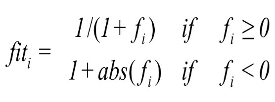

# Aprendizagem de enxames

Atividade realizada na cadeira de "Aprendizagem de Enxames" da pós graduação do Centro de Informática (CIN) - UFPE. Nessa atividade foram realizados experimentos utilizando dois algoritmos de aprendizagem de enxames, o Particle Swarm Optimization (PSO) e o Artificial Bee Colony (ABC). Além dos dois algorítmos base também foram realizados experimentos em uma variação de cada algoritmo.

## Métodos

### Particle Swarm Optimization (PSO)
Implementação do algoritmo base do PSO.

#### Equações
Velocidade da Partícula:


Atualização da Partícula:


#### Parâmetros
```
num_particulas  = Número de partículas
v_i             = Velocidade da i-ésima partícula
x_i             = Posição da i-ésima partícula
pbest_i         = Melhor posição da i-ésima partícula
g_best          = Melhor posição entre todas as partículas
w               = Ponderação de inércia
c_1             = Controla quão rápido a partícula vai convergir para 'pbest'
c_2             = Controla quão rápido a partícula vai convergir para 'gbest'
r               = Número aleatório entre 0 e 1
```

#### Fluxograma


### Particle Swarm Optimization (PSO) - Variação
Como variação do PSO foi implementado a versão em que as particulas são reinicializadas para posições aleatórias sempre que o 'g_best' fica 'n' iterações sem melhora. Essa melhoria da ao PSO a capacidade de fugir de mínimos locais.  

#### Novos Parâmetros
```
n_reboot = Número de Reinicializações
```

#### Fluxograma
 

### Artificial Bee Colony (ABC)
Implementação do algoritmo base do ABC.

#### Equações

Inicialização das fontes de comidas:


Atualização da fonte de comida:


Fitness:



Probabilidade:


#### Parâmetros
```
NP          = Tamanho da Colônia
n_epocas    = Número de Épocas
D           = Número de parâmetros a serem otimizados
limit       = Limite até abandonar uma fonte de comida. [default = (NP*D)/2]
food_number = Quantidade de fonte de comidas. [default = NP/2]
lb          = Limite inferior dos parâmetros
ub          = Limite superior dos parâmetros
x_i         = i-ésima fonte de comida
Φ           = Número aleatório entre -1 e 1
```

#### Algoritmo
```
for(run=0;run<bee.runtime;run++)
{
    bee.initial();
    bee.MemorizeBestSource();
    for (iter=0;iter<bee.maxCycle;iter++)
    {
        bee.SendEmployedBees();
        bee.CalculateProbabilities();
        bee.SendOnlookerBees();
        bee.MemorizeBestSource();
        bee.SendScoutBees();
    }
}
```
### Artificial Bee Colony (ABC) - Variação
A variação do ABC implementada faz a mudança do número fixo de épocas 'n_epocas' para otimização do algoritmo por um limite de épocas sem atualização da melhor fonte de alimento. Essa mudança permite que a otimização dos parâmetros não seja interrompida antes de se chegar em um mínimo local/global. Outro benefício dessa variação do ABC é a economia de recursos computacionais quando o algoritmo se encontra preso em um mínimo local, pois em vez de ter que rodar todas as épocas restantes, ele vai persistir somente até que o limia estabelecido de épocas sem melhora da melhor fonte de comida.
  
#### Novos Parâmetros
```
n_epocas_melhora = Número máximo de épocas sem que a melhor fonte de alimento seja melhorada.
```

## Benchmarks
Os métodos de swarm descritos acima foram testados em 6 benchmarks diferentes: Ackley function, Alpine function, Schwefel function, Happy Cat function, Brown function e Exponential function.

### Ackley Function

#### Equação


Dominio: [-32, 32]

Mínimo Global: [0, ..., 0]

#### Gráfico


### Alpine Function

#### Equação


Dominio: [0, 10]

Mínimo Global: [0, ..., 0]

#### Gráfico


### Schwefel Function

#### Equação


Dominio: [-500, 500]

Mínimo Global: [420.9687, ..., 420.9687]

#### Gráfico


### Happy Cat Function

#### Equação


Dominio: [-2, 2]

Mínimo Global: [-1, ..., -1]

#### Gráfico


### Brown Function

#### Equação


Dominio: [-1, 4]

Mínimo Global: [0, ..., 0]

#### Gráfico


### Exponential Function

#### Equação


Dominio: [-1, 1]

Mínimo Global: [0, ..., 0]

#### Gráfico


## Experimentos


## Resultados